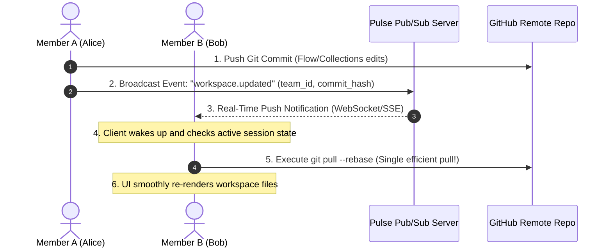

# Pulse Team Collaboration Architecture & Future Roadmap

This document outlines the current architecture of Pulse's team collaboration features, analyzes the technical implications of high-frequency Git polling, and provides a clear phase-by-phase roadmap to transition into a robust, premium, enterprise-ready real-time system.

---

## 🏗️ 1. Current Architecture: Local-First GitOps

Pulse currently uses a **Local-First GitOps** sync engine. Rather than relying on a centralized database with real-time socket connections, Pulse delegates the heavy lifting of storage, version history, branches, and conflict resolution directly to **Git**:

- **Repository as Bounded Context:** Each shared team workspace maps directly to a Git repository.
- **Tauri Git Bridge (`git.rs`):** Rust acts as the native system executor, running standard Git commands (`git fetch`, `git pull --rebase`, `git commit`, `git push`) locally on the workspace folder.
- **Sync Loop (`GitSync.tsx`):** A frontend timer that executes a Git synchronization operation every 10 seconds.

---

## ⚠️ 2. Technical Analysis: The 10-Second Polling Loop

### Will GitHub / GitLab Assume We Are a Bot?
**Yes, eventually.** Continuous 10-second polling (8,640 fetch requests per user per day) is highly likely to trigger rate-limiting, temporary IP throttling, or credential blocks on major SaaS Git providers. 

Here is a breakdown of how the limits work:

| Vector | Status / Behavior | Impact |
| :--- | :--- | :--- |
| **API Rate Limits** | Standard REST/GraphQL APIs have strict hourly caps (e.g. 5,000/hr). | Low risk (since standard `git fetch` operations bypass the REST/GraphQL APIs). |
| **Git Protocol Throttling** | GitHub monitors high-frequency SSH/HTTPS handshakes to protect against DDoS and scraping. | **High Risk.** Repetitive 10s fetches will trigger secondary rate-limits, prompting credential suspensions or temporary blocks. |
| **Resource Consumption** | Spawning a native Git subprocess every 10 seconds is CPU-intensive. | **High Battery Drain.** It continuously wakes up the system CPU, impacting laptop battery life and disk IOPS. |

### Is it Good or Not?
- **For Local / Private Hosting (Excellent):** If your team runs on a private network, Gitea, or self-hosted GitLab, this is a brilliant, zero-configuration solution that requires no server-side sync database.
- **For Production SaaS (Not Ideal):** For commercial desktop apps syncing with GitHub, it is unsafe. We need to transition from an active polling mechanism to an **event-driven push model**.

---

## 🗺️ 3. The Future Roadmap: Real-Time Hybrid Architecture

To build a premium, highly responsive, and battery-friendly collaboration layer, we should evolve the system into a **Hybrid Real-Time Pub/Sub & Git System**.

### Phase 1: Dynamic Polling & Smart Backoff (Immediate & Low Cost)
Before deploying real-time servers, we can make the polling engine significantly smarter:
- **Focus Detection:** Stop polling entirely if the desktop app is minimized, blurred, or in the background.
- **Idle Backoff:** If the user hasn't typed or executed requests for 5 minutes, back off the polling rate from 10s to 60s, then to 5 minutes, and eventually stop until active input is detected.
- **Manual Sync Trigger:** Add a beautiful "Sync Now" button in the header so users can manually force a git pull/push whenever they wish.

### Phase 2: Lightweight Pub/Sub WebSocket Ping (Event-Driven)
To eliminate background polling completely, introduce a tiny, secure WebSockets/SSE server (e.g., built on Bun/Hono, Supabase Realtime, or Pusher):
- **Channel Subscription:** When a workspace is loaded, Pulse opens a single, ultra-lightweight WebSocket connection subscribed to `workspace_id`.
- **Event-Driven Pull:** When Member A saves/pushes an edit, a message is broadcasted. Member B receives the websocket message and immediately triggers a **single `git pull`**.
- **No API Blocks:** GitHub/GitLab only receive fetches when actual updates occur, completely eliminating bot rate-limiting.

### Phase 3: Live In-App Presence & Cursor Sync
Leverage the real-time websocket channel to show who is currently working in the workspace:
- **Presence Indicators:** Show active team member avatars in the header with a glowing green dot if they are online.
- **Collaborative Flow Building:** Show active cursor highlights or select indicators when another user is modifying a specific API request or Flow Builder node.
